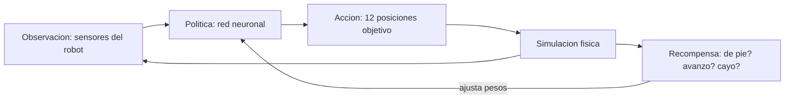
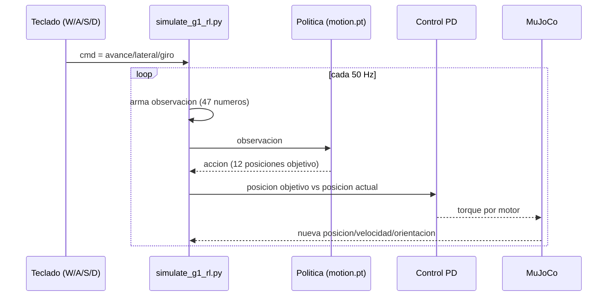

# Reinforcement Learning: cómo se mantiene parado el robot

*[English version](REINFORCEMENT_LEARNING.md)*

Este documento explica, en términos simples, cómo funciona la política de Reinforcement
Learning (RL) que usamos en [simulate_g1_rl.py](simulate_g1_rl.py) para que el G1 se mantenga
de pie y camine, y en qué se diferencia del controlador manual de
[interactive_unitree.py](interactive_unitree.py).

## El problema que resuelve

Un robot humanoide de pie es físicamente **inestable**: es una torre alta y angosta parada
sobre dos pies chicos. Cualquier pequeño error de ángulo en una pierna, cualquier empuje,
lo puede tirar. Mantenerlo de pie (y caminando) requiere corregir constantemente el
equilibrio, muchas veces por segundo.

Hay dos formas de resolver esto:

1. **A mano** (lo que hace `interactive_unitree.py`): un humano diseña fórmulas fijas
   (amplitud de zancada, flexión de rodilla, fuerzas de corrección) y las ajusta por prueba
   y error. Funciona, pero es frágil: cualquier situación no anticipada por esas fórmulas
   (una caja en el piso, un piso irregular, un empujón) la puede romper.
2. **Con una política aprendida** (lo que hace `simulate_g1_rl.py`): en vez de que un humano
   escriba las fórmulas, una red neuronal **aprendió sola**, a base de millones de intentos
   en simulación, qué torque mandarle a cada motor para no caerse. Esa red es la "política".

## Qué es Reinforcement Learning, en corto

RL es una forma de entrenar un programa (la "política") por prueba y error, no mostrándole
ejemplos correctos (como en aprendizaje supervisado), sino dejándolo actuar y dándole un
premio o castigo según el resultado.

Los cuatro elementos básicos:

- **Agente**: la política (red neuronal) que decide qué hacer.
- **Entorno**: la simulación física del robot (MuJoCo / Isaac Gym durante el entrenamiento).
- **Acción**: lo que el agente decide en cada instante (en este caso, la posición objetivo
  de cada uno de los 12 motores de las piernas).
- **Recompensa**: un número que le dice al agente qué tan bien lo hizo (por ejemplo: +premio
  por seguir la velocidad pedida y mantenerse erguido, -castigo por caerse o gastar mucha
  energía).

El entrenamiento consiste en repetir este ciclo millones de veces, en miles de simulaciones
en paralelo, ajustando la red neuronal poco a poco para que las acciones que llevan a mayor
recompensa se vuelvan más probables.



Ese ciclo de entrenamiento **no ocurre en este repo**: la política ya viene entrenada por
Unitree (el archivo [motion.pt](third_party/unitree_rl_gym/deploy/pre_train/g1/motion.pt)).
Lo que hacemos en `simulate_g1_rl.py` es solo la mitad derecha del diagrama, en modo
"inferencia" (usar la política ya entrenada, no seguir entrenándola).

## Cómo se usa esa política ya entrenada (lo que corre en este repo)

En cada ciclo de control (50 Hz, cada 10 pasos de físca de 2ms), `simulate_g1_rl.py` hace:

1. **Lee el estado del robot** (la "observación", 47 números):
   - Velocidad angular de la pelvis (giroscopio).
   - Hacia dónde apunta la gravedad vista desde el robot (si está inclinado, hacia adelante,
     hacia atrás, etc.).
   - El comando actual (avance / lateral / giro que vos le mandás con W/A/S/D).
   - Posición y velocidad de cada uno de los 12 motores de las piernas.
   - La última acción que tomó (para que tenga "memoria" de qué estaba haciendo).
   - Una señal de fase (seno/coseno) que le indica en qué punto del ciclo de paso está.

2. **Le pasa esa observación a la red neuronal** (`policy(obs_tensor)` en el código), que
   devuelve 12 números: la posición objetivo para cada motor de las piernas.

3. **Un controlador PD clásico** (no aprendido, matemática simple) convierte esa posición
   objetivo en el torque real que hay que aplicarle a cada motor:

   ```
   torque = (posicion_objetivo - posicion_actual) * kp + (velocidad_objetivo - velocidad_actual) * kd
   ```

4. **MuJoCo avanza la física** con esos torques, y el ciclo vuelve a empezar leyendo el
   nuevo estado del robot.



## Cuántos motores y "sensores" hay realmente

Es fácil perderse con tantos números. Esta tabla es la referencia exacta de este modelo
(`g1_12dof.xml`, el que usa `simulate_g1_rl.py`):

### Los 12 motores (actuadores)

Son `<motor>` de **torque**, no de posición (a diferencia del modelo con manos que usa
`interactive_unitree.py`). Eso importa porque el número que ves en el panel no es un
ángulo objetivo, es la fuerza que se está aplicando ahora mismo:

| # | Nombre | Articulación |
|---|---|---|
| 0 | `left_hip_pitch_joint` | cadera izquierda, adelante/atrás |
| 1 | `left_hip_roll_joint` | cadera izquierda, lado a lado |
| 2 | `left_hip_yaw_joint` | cadera izquierda, giro |
| 3 | `left_knee_joint` | rodilla izquierda |
| 4 | `left_ankle_pitch_joint` | tobillo izquierdo, adelante/atrás |
| 5 | `left_ankle_roll_joint` | tobillo izquierdo, lado a lado |
| 6 | `right_hip_pitch_joint` | cadera derecha, adelante/atrás |
| 7 | `right_hip_roll_joint` | cadera derecha, lado a lado |
| 8 | `right_hip_yaw_joint` | cadera derecha, giro |
| 9 | `right_knee_joint` | rodilla derecha |
| 10 | `right_ankle_pitch_joint` | tobillo derecho, adelante/atrás |
| 11 | `right_ankle_roll_joint` | tobillo derecho, lado a lado |

No hay motores de brazos/manos en este modelo (ver "Limitaciones" más abajo).

### Los 47 números de la observación ("sensores")

Ojo: **no son sensores físicos de MuJoCo** (no hay ningún `<sensor>` declarado en
`g1_12dof.xml`). Son 47 números que el script calcula en cada ciclo a partir del estado
físico (`qpos`/`qvel`) y se los pasa a la red. Así se arman, en orden:

| Rango en `obs[]` | Cantidad | Qué es | De dónde sale |
|---|---|---|---|
| `0:3` | 3 | Velocidad angular de la pelvis (giroscopio) | `data.qvel[3:6]` |
| `3:6` | 3 | Hacia dónde "cae" la gravedad visto desde el robot | calculado desde el cuaternión de orientación (`qpos[3:7]`) |
| `6:9` | 3 | Comando actual (avance, lateral, giro) ya escalado | tu `cmd` (W/A/S/D o UDP) × `cmd_scale` |
| `9:21` | 12 | Posición de cada uno de los 12 motores, relativa a la pose neutra | `data.qpos[7:19]` |
| `21:33` | 12 | Velocidad de cada uno de los 12 motores | `data.qvel[6:18]` |
| `33:45` | 12 | La acción que la red decidió el ciclo anterior (le da "memoria") | guardado del paso previo |
| `45:47` | 2 | Fase del ciclo de paso (seno/coseno) | reloj interno, no depende de sensores |

Total: 3+3+3+12+12+12+2 = **47**, que es exactamente `num_obs` en la config.

## Qué significan los paneles "Joint" y "Control" del visor

Si abrís el panel nativo de MuJoCo (los mismos de la captura de este chat), vas a ver dos
secciones separadas para los mismos 12 nombres, pero **no significan lo mismo**:

- **"Joint"**: es el ángulo real medido de cada articulación, en radianes (por ejemplo
  `left_knee_joint = 0.493` significa la rodilla izquierda flexionada ~28°). Es de solo
  lectura, viene de `data.qpos`.
- **"Control"**: es el **torque** (fuerza de giro, en Newton-metro) que se le está mandando
  a ese motor *en este instante*, calculado por la fórmula PD:

  ```
  torque = (posicion_objetivo - posicion_actual) * kp + (velocidad_objetivo - velocidad_actual) * kd
  ```

  Con `kp` hasta 150 para algunos motores, errores de posición chicos ya dan torques de
  20-30, como se ve en la captura (`left_hip_pitch_j = 21.8`, `left_hip_roll_j = 20.4`, etc.).

**Diferencia clave con el visor heurístico:** en `interactive_unitree.py` (modelo con
manos) el panel "Control" mueve motores de **posición**, así que arrastrar un slider ahí
sí deja al robot en esa pose (por eso existe el `--raw-mode`). Acá, en `simulate_g1_rl.py`,
el panel "Control" son motores de **torque** recalculados por nuestro propio código 500
veces por segundo — si arrastrás un slider ahí a mano, el próximo ciclo de física lo va a
pisar con el valor que calcula la política. Para este modelo, el control real se hace
siempre a través de `cmd` (W/A/S/D o `send_unitree_command.py`), no tocando el panel.

## Por qué esto mantiene mejor el equilibrio que las fórmulas a mano

- Las fórmulas a mano (`interactive_unitree.py`) fueron ajustadas para **una situación
  esperada** (piso plano, sin objetos, marcha hacia adelante). Cuando la realidad se desvía
  un poco de eso, se cae, porque las fórmulas no "saben" reaccionar a algo que no
  anticipamos.
- La política de RL fue entrenada con **miles de variaciones** (empujones aleatorios, pisos
  irregulares, distintas velocidades pedidas, fallas de sensor simuladas) en paralelo durante
  el entrenamiento. Aprendió una estrategia de balance mucho más general, no una fórmula fija
  para un solo caso.
- Prueba real en este repo: con `advance=0.5` caminó **~3.65 metros sin caerse**, incluso con
  cajas en el piso ([g1_warehouse_scene.xml](third_party/unitree_rl_gym/resources/robots/g1_description/g1_warehouse_scene.xml)),
  algo que el controlador a mano nunca logró de forma confiable.

## Limitaciones importantes

- Esta política **solo controla las 12 piernas**. No tiene brazos/manos entrenados, así que
  no puede agarrar ni manipular objetos, solo caminar hacia ellos.
- Fue entrenada en un entorno específico (probablemente piso plano en simulación). Terrenos
  muy distintos a eso (escaleras, pendientes fuertes) pueden no funcionar bien.
- Es una "caja negra": no hay fórmulas legibles que uno pueda ajustar a mano como en
  `interactive_unitree.py`. Si el comportamiento no gusta, la única forma de cambiarlo es
  reentrenar la red (algo que no hacemos en este repo, solo la corremos ya entrenada).

## Dónde está el código relevante

- [simulate_g1_rl.py](simulate_g1_rl.py): loop de inferencia descrito arriba.
- [third_party/unitree_rl_gym/deploy/pre_train/g1/motion.pt](third_party/unitree_rl_gym/deploy/pre_train/g1/motion.pt): la política ya entrenada (TorchScript).
- [third_party/unitree_rl_gym/resources/robots/g1_description/g1_12dof.xml](third_party/unitree_rl_gym/resources/robots/g1_description/g1_12dof.xml): el modelo físico (solo piernas) que la política espera controlar.
