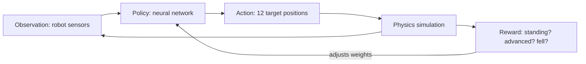
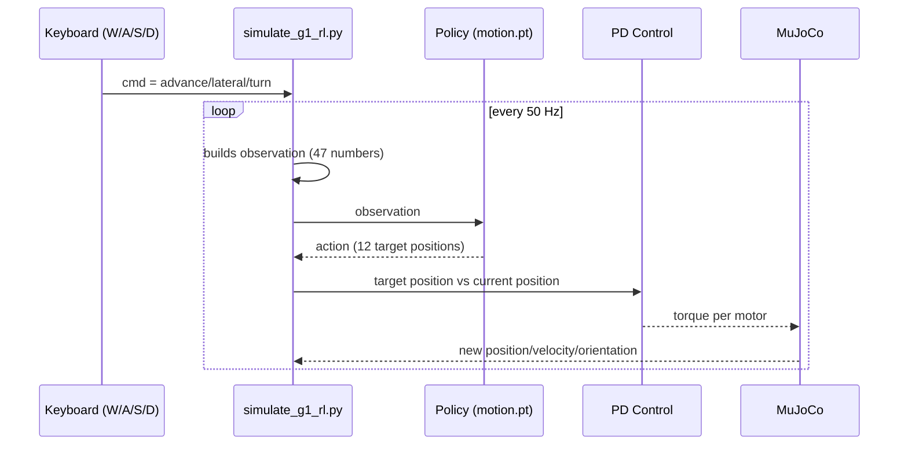

# Reinforcement Learning: how the robot stays standing

*[Versión en español](REINFORCEMENT_LEARNING.es.md)*

This document explains, in simple terms, how the Reinforcement Learning (RL) policy we
use in [simulate_g1_rl.py](simulate_g1_rl.py) works to keep the G1 standing and walking,
and how it differs from the manual controller in
[interactive_unitree.py](interactive_unitree.py).

## The problem it solves

A standing humanoid robot is physically **unstable**: it's a tall, narrow tower standing
on two small feet. Any small angle error in a leg, any push, can knock it over. Keeping
it standing (and walking) requires constantly correcting balance, many times per second.

There are two ways to solve this:

1. **By hand** (what `interactive_unitree.py` does): a human designs fixed formulas
   (stride amplitude, knee flexion, correction forces) and tunes them by trial and
   error. It works, but it's fragile: any situation not anticipated by those formulas
   (a box on the floor, an uneven floor, a push) can break it.
2. **With a learned policy** (what `simulate_g1_rl.py` does): instead of a human writing
   the formulas, a neural network **learned on its own**, through millions of attempts
   in simulation, what torque to send to each motor to avoid falling. That network is
   the "policy".

## What Reinforcement Learning is, in short

RL is a way to train a program (the "policy") by trial and error, not by showing it
correct examples (as in supervised learning), but by letting it act and giving it a
reward or penalty based on the outcome.

The four basic elements:

- **Agent**: the policy (neural network) that decides what to do.
- **Environment**: the physical simulation of the robot (MuJoCo / Isaac Gym during
  training).
- **Action**: what the agent decides at each instant (in this case, the target position
  of each of the 12 leg motors).
- **Reward**: a number that tells the agent how well it did (e.g.: +reward for following
  the requested velocity and staying upright, -penalty for falling or wasting a lot of
  energy).

Training consists of repeating this cycle millions of times, across thousands of
parallel simulations, gradually adjusting the neural network so that actions leading to
higher reward become more likely.



That training cycle **does not happen in this repo**: the policy comes already trained
by Unitree (the file
[motion.pt](third_party/unitree_rl_gym/deploy/pre_train/g1/motion.pt)). What we do in
`simulate_g1_rl.py` is only the right half of the diagram, in "inference" mode (using
the already-trained policy, not continuing to train it).

## How that already-trained policy is used (what runs in this repo)

On each control cycle (50 Hz, every 10 physics steps of 2ms), `simulate_g1_rl.py` does:

1. **Reads the robot's state** (the "observation", 47 numbers):
   - Pelvis angular velocity (gyroscope).
   - Which direction gravity points as seen from the robot (whether it's tilted
     forward, backward, etc.).
   - The current command (advance / lateral / turn you send with W/A/S/D).
   - Position and velocity of each of the 12 leg motors.
   - The last action it took (so it has "memory" of what it was doing).
   - A phase signal (sine/cosine) indicating where it is in the step cycle.

2. **Passes that observation to the neural network** (`policy(obs_tensor)` in the
   code), which returns 12 numbers: the target position for each leg motor.

3. **A classic PD controller** (not learned, simple math) converts that target
   position into the actual torque to apply to each motor:

   ```
   torque = (target_position - current_position) * kp + (target_velocity - current_velocity) * kd
   ```

4. **MuJoCo advances the physics** with those torques, and the cycle starts again
   reading the robot's new state.



## How many motors and "sensors" there really are

It's easy to get lost with so many numbers. This table is the exact reference for this
model (`g1_12dof.xml`, the one `simulate_g1_rl.py` uses):

### The 12 motors (actuators)

These are **torque** `<motor>` actuators, not position ones (unlike the hands model
used by `interactive_unitree.py`). That matters because the number you see in the panel
is not a target angle, it's the force currently being applied:

| # | Name | Joint |
|---|---|---|
| 0 | `left_hip_pitch_joint` | left hip, forward/backward |
| 1 | `left_hip_roll_joint` | left hip, side to side |
| 2 | `left_hip_yaw_joint` | left hip, rotation |
| 3 | `left_knee_joint` | left knee |
| 4 | `left_ankle_pitch_joint` | left ankle, forward/backward |
| 5 | `left_ankle_roll_joint` | left ankle, side to side |
| 6 | `right_hip_pitch_joint` | right hip, forward/backward |
| 7 | `right_hip_roll_joint` | right hip, side to side |
| 8 | `right_hip_yaw_joint` | right hip, rotation |
| 9 | `right_knee_joint` | right knee |
| 10 | `right_ankle_pitch_joint` | right ankle, forward/backward |
| 11 | `right_ankle_roll_joint` | right ankle, side to side |

There are no arm/hand motors in this model (see "Limitations" below).

### The 47 observation numbers ("sensors")

Careful: **these are not physical MuJoCo sensors** (there's no `<sensor>` declared in
`g1_12dof.xml`). They are 47 numbers the script computes each cycle from the physical
state (`qpos`/`qvel`) and passes to the network. Here's how they're assembled, in order:

| Range in `obs[]` | Count | What it is | Where it comes from |
|---|---|---|---|
| `0:3` | 3 | Pelvis angular velocity (gyroscope) | `data.qvel[3:6]` |
| `3:6` | 3 | Direction gravity "falls" as seen from the robot | computed from the orientation quaternion (`qpos[3:7]`) |
| `6:9` | 3 | Current command (advance, lateral, turn), already scaled | your `cmd` (W/A/S/D or UDP) × `cmd_scale` |
| `9:21` | 12 | Position of each of the 12 motors, relative to the neutral pose | `data.qpos[7:19]` |
| `21:33` | 12 | Velocity of each of the 12 motors | `data.qvel[6:18]` |
| `33:45` | 12 | The action the network decided on the previous cycle (gives it "memory") | saved from the previous step |
| `45:47` | 2 | Step-cycle phase (sine/cosine) | internal clock, doesn't depend on sensors |

Total: 3+3+3+12+12+12+2 = **47**, which is exactly `num_obs` in the config.

## What the "Joint" and "Control" viewer panels mean

If you open MuJoCo's native panel (the same ones from this chat's screenshot), you'll
see two separate sections for the same 12 names, but **they don't mean the same thing**:

- **"Joint"**: is the real measured angle of each joint, in radians (e.g.
  `left_knee_joint = 0.493` means the left knee flexed ~28°). It's read-only, it comes
  from `data.qpos`.
- **"Control"**: is the **torque** (turning force, in Newton-meters) currently being
  sent to that motor *at this instant*, computed by the PD formula:

  ```
  torque = (target_position - current_position) * kp + (target_velocity - current_velocity) * kd
  ```

  With `kp` up to 150 for some motors, small position errors already produce torques of
  20-30, as seen in the screenshot (`left_hip_pitch_j = 21.8`, `left_hip_roll_j =
  20.4`, etc.).

**Key difference from the heuristic viewer:** in `interactive_unitree.py` (hands model)
the "Control" panel moves **position** motors, so dragging a slider there does leave the
robot in that pose (that's why `--raw-mode` exists). Here, in `simulate_g1_rl.py`, the
"Control" panel shows **torque** motors recalculated by our own code 500 times per
second — if you drag a slider there by hand, the next physics cycle will overwrite it
with the value the policy computes. For this model, real control is always done through
`cmd` (W/A/S/D or `send_unitree_command.py`), not by touching the panel.

## Why this keeps balance better than hand-written formulas

- The hand-written formulas (`interactive_unitree.py`) were tuned for **one expected
  situation** (flat floor, no objects, forward march). When reality deviates a bit from
  that, it falls, because the formulas don't "know" how to react to something we didn't
  anticipate.
- The RL policy was trained with **thousands of variations** (random pushes, uneven
  floors, different requested speeds, simulated sensor failures) in parallel during
  training. It learned a much more general balancing strategy, not a fixed formula for
  a single case.
- Real test in this repo: with `advance=0.5` it walked **~3.65 meters without falling**,
  even with boxes on the floor
  ([g1_warehouse_scene.xml](third_party/unitree_rl_gym/resources/robots/g1_description/g1_warehouse_scene.xml)),
  something the hand-tuned controller never achieved reliably.

## Important limitations

- This policy **only controls the 12 legs**. It has no trained arms/hands, so it can't
  grab or manipulate objects, only walk toward them.
- It was trained in a specific environment (probably a flat floor in simulation).
  Very different terrains (stairs, steep slopes) may not work well.
- It's a "black box": there are no readable formulas you can tune by hand like in
  `interactive_unitree.py`. If the behavior isn't to your liking, the only way to
  change it is to retrain the network (something we don't do in this repo, we only run
  it already trained).

## Where the relevant code is

- [simulate_g1_rl.py](simulate_g1_rl.py): the inference loop described above.
- [third_party/unitree_rl_gym/deploy/pre_train/g1/motion.pt](third_party/unitree_rl_gym/deploy/pre_train/g1/motion.pt): the already-trained policy (TorchScript).
- [third_party/unitree_rl_gym/resources/robots/g1_description/g1_12dof.xml](third_party/unitree_rl_gym/resources/robots/g1_description/g1_12dof.xml): the physical model (legs only) that the policy expects to control.
