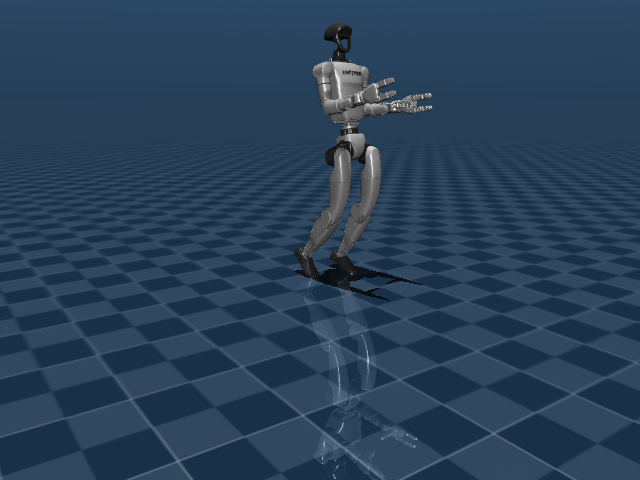
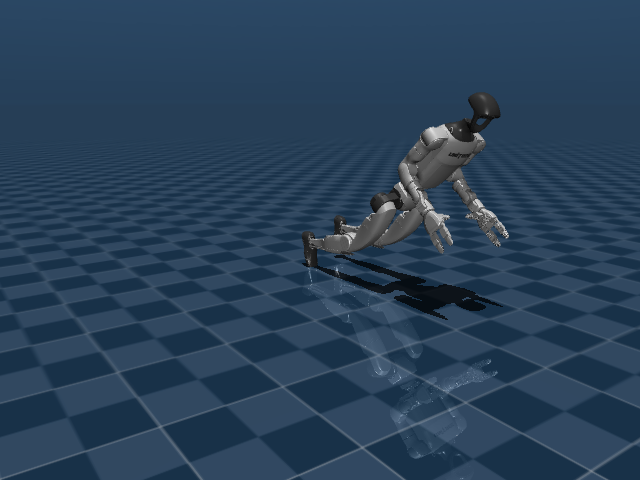

# Stage 1 — Heuristic control (by hand), motor by motor

*[Versión en español](01-control-heuristico.es.md)*

## Objective of this stage

Make the robot walk forward using a controller written entirely by hand (fixed
formulas per motor + a correction force applied to the pelvis), and reproducibly find
the conditions under which it falls. This stage is the starting point and the
comparison baseline for stages 2 and 3: without a real "here it falls" number, there's
no objective way to later say RL is better.

By the end of this stage you'll be able to reproduce, step by step: open the viewer,
send it an advance command, watch it walk a few steps, and watch it lose balance and
fall.

## How to run it

Start the viewer (automatically kills any previous instance):

```bash
./run_viewer.sh
```

In another terminal, send commands via remote control (UDP):

```bash
.venv/bin/python send_unitree_command.py --advance 0.5
```

Other useful variants:

```bash
# marching in place (lift legs without advancing)
.venv/bin/python send_unitree_command.py --march 1.0

# keyboard control instead of one-off commands
.venv/bin/python teleop_unitree.py --host 127.0.0.1 --port 47001

# move each motor by hand from the viewer's native panel
.venv/bin/python send_unitree_command.py --raw-mode
```

## What it consists of

The controller ([interactive_unitree.py](../interactive_unitree.py)) translates a
high-level command (`advance`, `turn`, `march in place`) into target angles for 12+
position motors (hip, knee, ankle, waist, shoulders), using hand-written formulas:
stride amplitude, frequency, lateral weight transfer, and a correction force applied
directly to the pelvis body (`data.xfrc_applied`) to try to keep it upright. The full
mathematical detail is in [WALKING.md](../WALKING.md).

It's the "classic" approach: nothing was trained, a human tuned the numbers by trial
and error until the robot walked a few steps without falling.

## What we're looking at

- The MuJoCo viewer window, with the G1 robot standing on the checkered floor.
- The messages the script prints in the terminal (`[viewer] avance=... giro=...`,
  `[viewer] caida detectada, reiniciando en stand`).
- Optionally, the native "Control" panel with a slider per motor (see below).

## How we look at it

- **Visually**: the camera automatically follows the pelvis
  (`mujoco.mjtCamera.mjCAMERA_TRACKING`), so the robot doesn't leave the frame while
  walking or falling.
- **Via console**: every command change or fall is printed as text (`[viewer] ...`), so
  you can confirm without watching the window whether the robot stayed standing during
  a long test.
- **Motor by motor**: enabling `--raw-mode`, the control loop stops writing to the
  actuators and the viewer's "Control" panel starts sending directly to each position
  motor. It's useful to verify, moving one slider at a time, which way each joint turns
  — instead of guessing by looking at a screenshot.

## How we solve it

- Each joint is controlled by a **position** actuator (not torque): the value sent is
  the target angle, and MuJoCo automatically applies the force needed to approach that
  angle.
- Walking is built by combining, in phase, hip + knee + ankle of the "swinging" leg and
  the "stance" leg, plus a lateral weight transfer so the lifted foot doesn't slip.
- To avoid falling, a balance assist is added: a corrective torque (roll/pitch) applied
  directly to the pelvis based on orientation and gyroscope (IMU), and a vertical force
  proportional to the height error. It is, literally, an invisible hand helping the
  robot — it's not how a real robot stays standing.

## Real screenshots

These images come from a real headless run (same code the viewer uses, without a
window) with `advance=0.5` sustained and no human correction in real time:

| Walking (t=1.00s, pelvis height 0.782m) | Falling (t=1.73s, pelvis height 0.497m) |
|---|---|
|  |  |

In under 2 seconds, with nobody adjusting turn or amplitude, the robot loses balance
forward and falls — the same fragility described in the previous section, but much
faster than it would take an operator reacting during real teleop.

## Problems we ran into

- **The robot falls with sustained commands.** With `advance=1.0` for a long time, it
  eventually falls and the script itself detects it and resets
  (`caida detectada, reiniciando en stand`). Manual control never became reliable over
  the long run.
- **Sign confusion in the gait.** When increasing hip flexion amplitude so the thigh
  would lift more, visually the thigh went **backward** (like a kick), not forward.
  Flipping the sign fixed the direction but made the robot fall repeatedly at that
  magnitude — the amplitude had to be lowered to an intermediate value and retested.
- **Contradictory notes between sessions.** An earlier session had concluded that
  "positive is already forward" and that the problem was something else (the knee
  dominating over the hip). Trusting an old note without re-verifying almost caused a
  repeated mistake — the lesson: always re-verify the real sign with `--raw-mode`
  instead of assuming.
- **Duplicate viewers.** Each test opened a new window without closing the previous
  one, causing confusion about which one to watch. Fixed by having `run_viewer.sh` kill
  any previous instance (`pkill -f simulate_unitree.py`) before opening a new one.
- **The camera stayed fixed** while the robot walked and left the frame. Fixed by
  enabling MuJoCo's native "tracking" camera, which automatically follows the pelvis.

## Next stage

With this approach, keeping balance depends 100% on hand-tuned formulas and artificial
forces. [Stage 2](02-reinforcement-learning.md) tries the same task with a trained
policy, with no external tricks.
