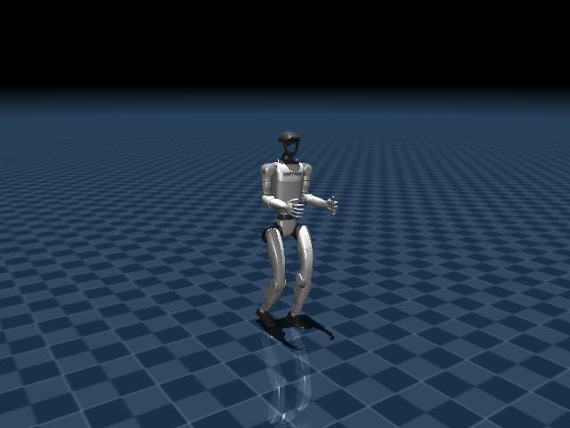
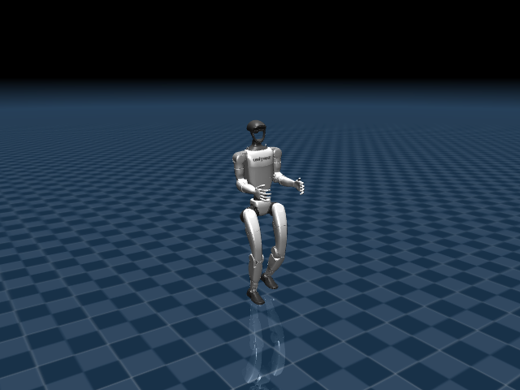

# Etapa 2 — La misma tarea, con una política de Reinforcement Learning

## Cómo se ejecuta

Levantar el visor con la política RL ya entrenada (mata cualquier visor anterior,
heurístico o RL):

```bash
./run_viewer_rl.sh
```

Controlarlo con teclado directo en la ventana del visor — `W/S` avanza/retrocede,
`A/D` gira, espacio centra, `R` reinicia, `P/O` pausa/reanuda — o por UDP desde otra
terminal, igual que en la etapa 1:

```bash
.venv/bin/python send_unitree_command.py --advance 0.6
```

## En qué consiste

En vez de escribir fórmulas de caminata a mano, acá corremos una red neuronal ya
entrenada por Unitree con Reinforcement Learning ([unitree_rl_gym](https://github.com/unitreerobotics/unitree_rl_gym)),
que decide qué posición objetivo darle a cada uno de los 12 motores de las piernas, 500
veces por segundo, a partir de cómo está parado el robot en ese instante. El detalle
completo — qué es RL, cómo se arma la observación, cómo se calcula el torque — está en
[REINFORCEMENT_LEARNING.md](../REINFORCEMENT_LEARNING.md); esta página es la experiencia
práctica de correrla y compararla con la etapa 1.

Técnicamente esto vive en [simulate_g1_rl.py](../simulate_g1_rl.py), que reimplementa el
script oficial `deploy_mujoco.py` de unitree_rl_gym sin depender de `legged_gym`/`isaacgym`
(que no corren en macOS), reutilizando nuestro propio [external_control.py](../external_control.py)
para que `avance/lateral/giro` funcionen igual que en la etapa 1.

## Qué estamos mirando

- La misma ventana de visor, pero con un modelo de 12 motores (solo piernas, sin
  brazos/manos articulados).
- El panel nativo "Joint" (ángulo medido de cada motor) y "Control" (torque que se le está
  aplicando ahora mismo) — ver la sección de abajo, porque acá significan algo distinto que
  en la etapa 1.
- Los mensajes de estado en la terminal (`[rl] avance=... giro=...`, `[rl] control externo
  UDP en ...`).

## Cómo lo miramos

- **Comparación directa con la etapa 1**: mismos comandos (`--advance`, `--march` no
  aplica acá porque no hay modo "marcha en el sitio" explícito, pero `--advance` sostenido
  se puede dejar corriendo mucho más tiempo sin que se caiga).
- **Prueba headless** (sin abrir ventana, para medir en frío): se instrumentó un script
  descartable que corre la física 8 segundos con `cmd=(0.5, 0, 0)` y registra la altura de
  la pelvis cada 0.4s. Resultado real medido:

  ```
  alturas pelvis: [0.793, 0.77, 0.771, 0.77, 0.773, 0.767, 0.772, 0.768, ...]
  posición final: x=3.65m
  ```

  El robot avanzó **3.65 metros sin caerse**, con la pelvis siempre entre 0.76 y 0.79m.
- **Prueba de "quedarse quieto"**: con `cmd=(0,0,0)` durante 8 segundos, la pelvis se
  mantuvo estable (~0.78m) con solo ~0.17m de deriva — confirmando que centrar el joystick
  no es lo mismo que pausar: la política sigue sosteniendo el equilibrio sola.

## Cómo lo resolvemos

- Los 12 motores de este modelo son de **torque** (`<motor>`), no de posición. La política
  entrega una posición objetivo, y un controlador PD clásico (matemática simple, no
  aprendida) calcula el torque real: `torque = (objetivo - actual) * kp + (vel_objetivo -
  vel_actual) * kd`.
- La observación que recibe la red (47 números: velocidad angular, orientación respecto a
  la gravedad, comando, posición/velocidad de las 12 piernas, acción anterior, fase del
  paso) resume "cómo está parado el robot ahora", y la red devuelve directamente qué hacer
  — el equilibrio no está en una fórmula que escribimos nosotros, está codificado en los
  pesos de la red, aprendidos por prueba y error en simulación durante el entrenamiento
  (que no hacemos acá, solo usamos el resultado ya entrenado).
- **Importante**: en este visor, mover un slider del panel "Control" a mano **no sirve**
  para nada persistente — nuestro propio código recalcula y sobreescribe el torque de cada
  motor en cada paso de física (cada 2ms). El control real siempre es a través de `cmd`.

## Capturas reales

Misma prueba headless, con `cmd=(0.6, 0, 0)` sostenido sin ninguna correccion humana:

| Inicio (t=1.00s) | Despues de caminar (t=7.00s, x=3.77m, altura pelvis 0.769m) |
|---|---|
|  |  |

A diferencia de la etapa 1, acá 6 segundos adicionales de avance sostenido no
provocan ninguna caída: la altura de la pelvis se mantiene prácticamente igual
(0.769m) mientras el robot avanzó 3.77 metros en línea recta.

## Qué problemas encontramos

- **Dependencias pesadas que no hacían falta.** El script oficial de Unitree
  (`deploy_mujoco.py`) importa el paquete `legged_gym`, que a su vez depende de
  `isaacgym` — que no funciona en macOS. Se resolvió reimplementando el mismo bucle
  (PD + observación + política) sin esa dependencia, usando directamente `torch.jit.load`
  sobre el archivo de política ya entrenado (`motion.pt`, formato TorchScript, no necesita
  el código de entrenamiento para correr).
- **El robot se salía de cuadro al caminar.** La cámara del visor no seguía al robot por
  defecto. Se resolvió con la cámara de "tracking" nativa de MuJoCo (igual que en la
  etapa 1).
- **Confusión entre los paneles "Joint" y "Control".** A primera vista parecen sliders
  editables como en la etapa 1, pero acá "Control" muestra **torque**, no un ángulo
  objetivo — mover uno a mano no tiene efecto duradero. Quedó documentado en detalle en
  [REINFORCEMENT_LEARNING.md](../REINFORCEMENT_LEARNING.md#qué-significan-los-paneles-joint-y-control-del-visor).
- **Publicar los assets a GitHub casi rompió el repo.** Al clonar `unitree_rl_gym` con
  `git clone` normal, quedó un `.git` anidado adentro de `third_party/unitree_rl_gym`; al
  hacer commit, git lo registró como un submódulo roto (sin `.gitmodules`) — cualquiera que
  clonara el repo se hubiera encontrado con una carpeta vacía. Se resolvió borrando el
  `.git` anidado y re-agregando los archivos reales antes de publicar.

## Siguiente etapa

La política solo camina en un piso vacío hasta ahora. La [Etapa 3](03-objetos-en-el-escenario.md)
le agrega obstáculos reales (cajas y un estante) para ver si el equilibrio se sostiene
también al chocar contra algo.
