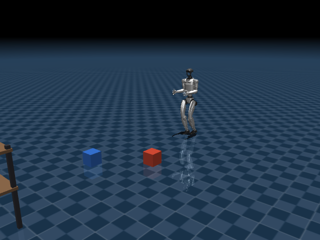
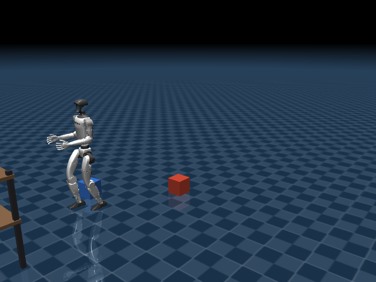

# Stage 3 — Adding objects to the scene: does it stay standing if it collides?

*[Versión en español](03-objetos-en-el-escenario.es.md)*

## Objective of this stage

Check whether the RL policy from stage 2 keeps holding balance when the path isn't
empty: we add two loose boxes and a shelf to the scene, something the policy's original
training didn't explicitly account for. The question this stage answers is concrete:
does the robot collide, push the object, and stay standing, or does it fall when facing
an unanticipated obstacle?

By the end of this stage you'll be able to reproduce the same walk from stage 2, now
with real physical obstacles in the path, and verify with your own eyes (and with the
position/height numbers we logged) whether the robot pushes them and stays standing.

## How to run it

Start the RL viewer pointing at the scene with objects (two boxes and a shelf):

```bash
.venv/bin/mjpython simulate_g1_rl.py --scene third_party/unitree_rl_gym/resources/robots/g1_description/g1_warehouse_scene.xml
```

Send it walking straight toward the boxes:

```bash
.venv/bin/python send_unitree_command.py --advance 0.6
```

## What it consists of

Up through stage 2, the robot walked on an empty floor. Here we add a scene with real
physical objects — two loose boxes (not anchored, with `<freejoint/>`, they can be
pushed) and a fixed two-level shelf — to check whether the RL policy keeps holding
balance when it also has to deal with collisions not anticipated during the original
training.

The scene is a new MJCF file,
[g1_warehouse_scene.xml](../third_party/unitree_rl_gym/resources/robots/g1_description/g1_warehouse_scene.xml),
which is passed to `simulate_g1_rl.py` with `--scene`.

## What we're looking at

- The robot walking toward two boxes (red and blue) and a shelf placed ahead of its
  starting point.
- Whether it pushes them on contact (real physical collision, not a "fake" bump), and
  whether it stays standing or falls after pushing them.
- Pelvis height throughout the run, same as in stage 2.

## How we look at it

A headless test (no window) was instrumented that:

1. Loads the model with the objects scene.
2. Sends `cmd=(0.5, 0, 0)` (advance).
3. Runs 6 seconds of physics, logging pelvis height every 0.4s and the final position
   of each box.

Real measured result:

```
total nq (robot+boxes): 33   total nv: 30
pelvis heights: [0.793, 0.77, 0.771, 0.77, 0.773, 0.767, 0.772, 0.768, ...]
final robot xy position: [2.70, -0.16]
box A pos: [2.20, 0.35, 0.10]      -> barely moved
box B pos: [2.92, -0.41, 0.10]     -> shifted from [2.80, -0.35], the robot pushed it
```

The robot advanced from x=0 to x≈2.7m in 6 seconds, pushed box B along the way, and the
pelvis never dropped below ~0.77m — no fall.

## How we solve it

- The boxes are added as `<body>` with `<freejoint/>` (free bodies, with real collision
  and gravity physics), not as fixed decoration — that's why they can be pushed.
- The shelf is static geometry (no `freejoint`), meant as a fixed obstacle/destination
  to walk toward, not to be pushed.
- The policy knows nothing about these specific objects (they weren't part of its
  training), but its balancing strategy is general enough to absorb the impact of
  hitting something without losing balance, at least with light objects (0.5 kg) and
  moderate speeds.

## Real screenshots

Same headless test with the `g1_warehouse_scene.xml` scene, `cmd=(0.6, 0, 0)`:

| Approaching (t=1.50s, x=0.66m) | After passing the boxes (t=6.00s, x=3.21m, pelvis height 0.768m) |
|---|---|
|  |  |

The robot reaches the blue box, displaces it while passing by, and stays standing with
the pelvis at its usual height (~0.77m) — no fall despite the physical contact
unanticipated by the original training.

## Problems we ran into

- **The meshes (STL) weren't found when loading the scene.** MuJoCo's relative
  `meshdir` (declared in `g1_12dof.xml` as `meshdir="meshes/"`) doesn't reliably resolve
  when the scene file that does the `<include>` lives in a different folder than the
  robot's. We tried:
  1. Putting the scene in `scenes/` with a relative path `../third_party/...` — failed,
     it looked for the file without the `meshes/` subdirectory.
  2. Adding an explicit `<compiler meshdir="...">` in the scene file — also failed,
     with a different mesh each time.

  The solution that worked 100%: put the scene file **in the same folder** as
  `g1_12dof.xml` (exactly the same pattern the official Unitree `scene.xml` uses), with
  `<include file="g1_12dof.xml"/>` with no path prefix at all. That's why
  `g1_warehouse_scene.xml` lives inside `third_party/unitree_rl_gym/...` instead of
  `scenes/`.

- **The observation vector would have silently gotten corrupted.** The original code
  read `data.qpos[7:]` and `data.qvel[6:]` with no upper bound, assuming the robot was
  the only body with degrees of freedom. As soon as the boxes are added (each adds 7
  `qpos` values and 6 `qvel` values for its `freejoint`), that slice would have also
  included the boxes' position, giving the policy a vector of the wrong size and
  content. Fixed by explicitly bounding the slice to the 12 leg values
  (`slice(7, 7+12)` and `slice(6, 6+12)`), computed once and reused throughout the
  script.

## Summary of the 3 stages

| Stage | What we tested | What we saw |
|---|---|---|
| [1. Heuristic](01-control-heuristico.md) | Hand-written formulas per motor + remote control | Each motor works, but the whole thing falls easily |
| [2. RL](02-reinforcement-learning.md) | Already-trained policy, same task | Walks long distances without falling |
| [3. RL + objects](03-objetos-en-el-escenario.md) | Scene with boxes and a shelf | Collides, pushes objects, and stays standing |
